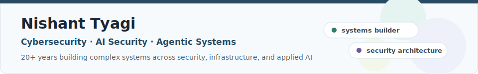
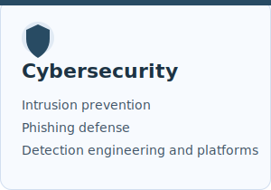
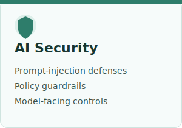
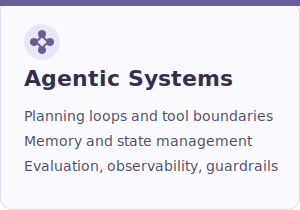

# Nishant Tyagi

**Cybersecurity · AI Security · Agentic Systems**

I build security infrastructure for complex systems: intrusion prevention, phishing detection, cloud-scale platforms, AI security controls, and guardrails for LLM and agentic workflows. I have 20+ years of experience across cybersecurity, infrastructure, applied AI, and secure platform architecture.

[cybertect.ai](https://cybertect.ai) · [LinkedIn](https://www.linkedin.com/in/nishant-tyagi-builder/) · [ORCID](https://orcid.org/0009-0008-4747-6088)

## What I Build

<table>
  <tr>
    <td width="33%" valign="top" align="center">
      
    </td>
    <td width="33%" valign="top" align="center">
      
    </td>
    <td width="33%" valign="top" align="center">
      
    </td>
  </tr>
</table>

## Open source

**[sigmalint](https://github.com/ni5h4nt/sigmalint)** · ESLint-style linter for Sigma detection rules, with deterministic quality checks for maintainability, metadata hygiene, logic structure, and platform portability. MIT licensed, available on [PyPI](https://pypi.org/project/sigmalint-cli/), and citable via [DOI](https://doi.org/10.5281/zenodo.20371168).

**[prompt-injection-scanner](https://github.com/ni5h4nt/prompt-injection-scanner)** · Defensive tool for detecting prompt injection attacks in LLM applications. Multi-stage pipeline (heuristics, vector similarity, LLM guardian) with structured-output policy guardrails.

**Upstream** · Machine-readable per-rule changelog for the Sigma standard: [SigmaHQ/sigma #6050](https://github.com/SigmaHQ/sigma/pull/6050).

## Research & standards

- [SoK: AI-Assisted Threat Intelligence Pipelines](https://doi.org/10.5281/zenodo.20371686) (preprint, 2026)
- [Static Quality Assessment of Sigma Detection Rules: Framework and Empirical Evaluation](https://doi.org/10.5281/zenodo.20371761) (preprint, 2026)
- Public technical comments to NIST on SP 800-133r3 (cryptographic key generation) and the AI Risk Management Framework roadmap (TEVV for multi-agent AI systems)

## Background

- 20+ years building complex systems across security, infrastructure, and applied AI
- Principal Software Engineer at System Two Security (Detections.ai), building AI-assisted security systems and detection infrastructure
- Earlier: intrusion detection and prevention engine work at Symantec (Broadcom), AI-driven phishing detection at Bolster
- Carnegie Mellon University, MS Information Technology, Information Security (2013) · MIT Professional Education, Applied Data Science (2023) · CISSP

## Writing

Latest from [cybertect.ai](https://cybertect.ai/insights):

<!-- BLOG-POST-LIST:START -->
- [Beyond Model Hardening: The Two-Layer Defense Your LLM Deployment Is Missing](https://cybertect.ai/insights/beyond-model-hardening-the-two-layer-defense-your-llm-deployment-is-missing)
- [Your AI Agent Has No Guardrails. PCAS Changes That with a Compiler, Not a Prayer](https://cybertect.ai/insights/your-ai-agent-has-no-guardrails-pcas-changes-that-with-a-compiler-not-a-prayer)
- [Your AI Has a Gut Feeling Problem](https://cybertect.ai/insights/your-ai-has-a-gut-feeling-problem)
- [The Agentic Displacement: A Multi-Trillion Dollar Revaluation](https://cybertect.ai/insights/the-agentic-displacement-a-multi-trillion-dollar-revaluation)
- [Ontology in Agentic Workflows: Why It's Necessary](https://cybertect.ai/insights/ontology-in-agentic-workflows-why-its-necessary)
<!-- BLOG-POST-LIST:END -->

Also: [30 system design walkthroughs](https://ni5h4nt.github.io/system-design/html/index.html) with Mermaid architecture diagrams.
